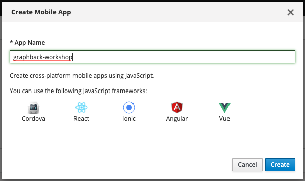
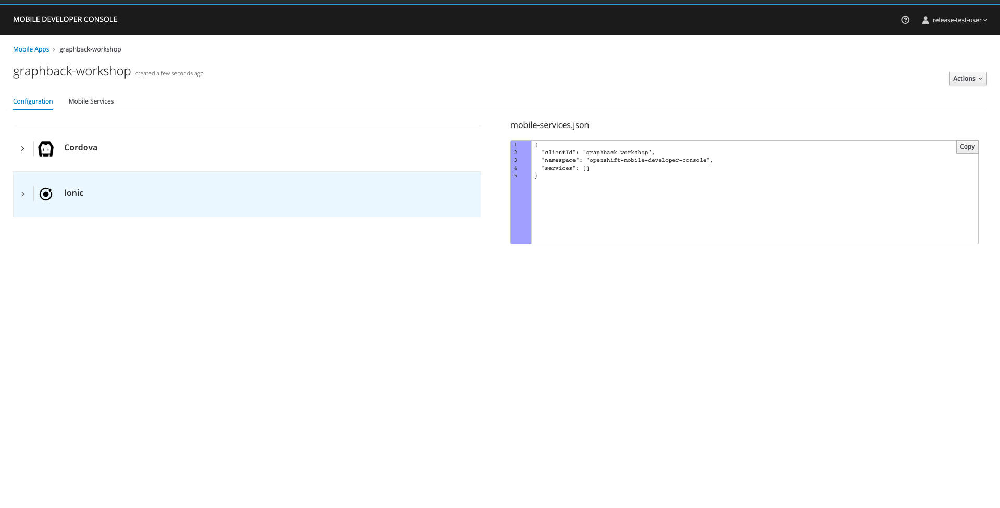
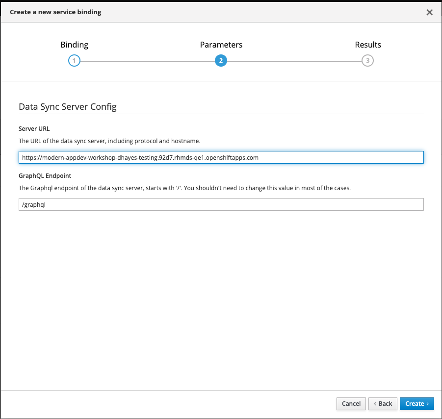
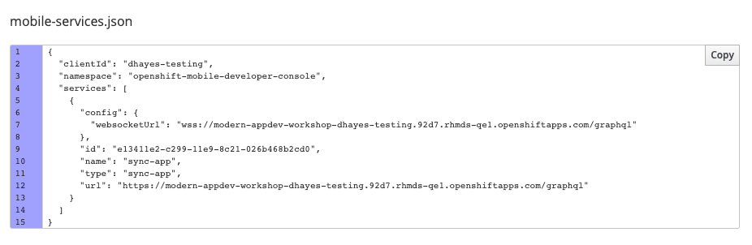
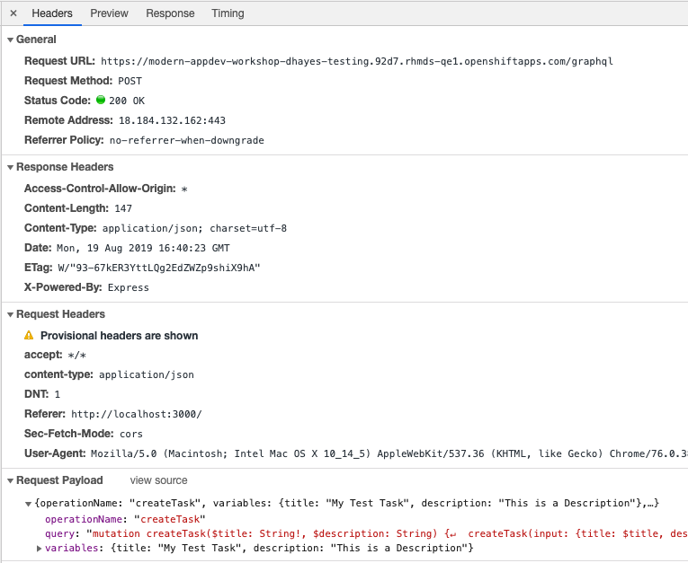
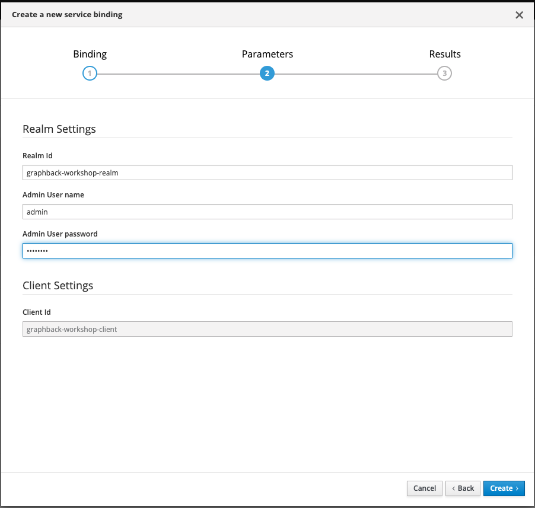
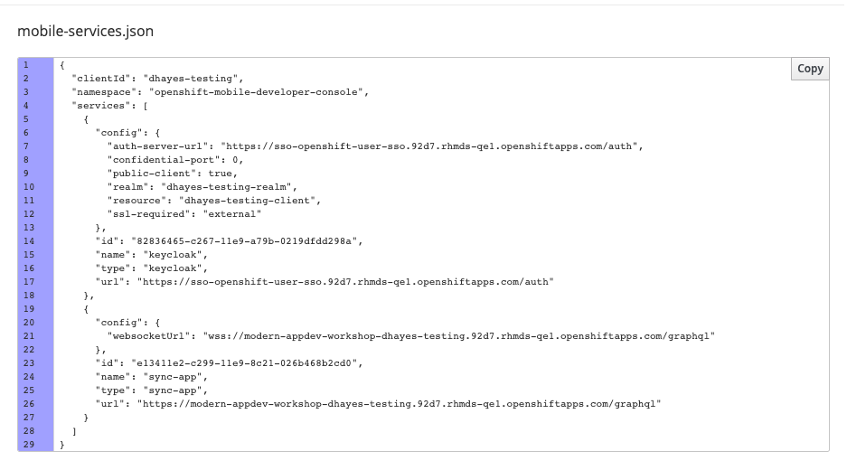
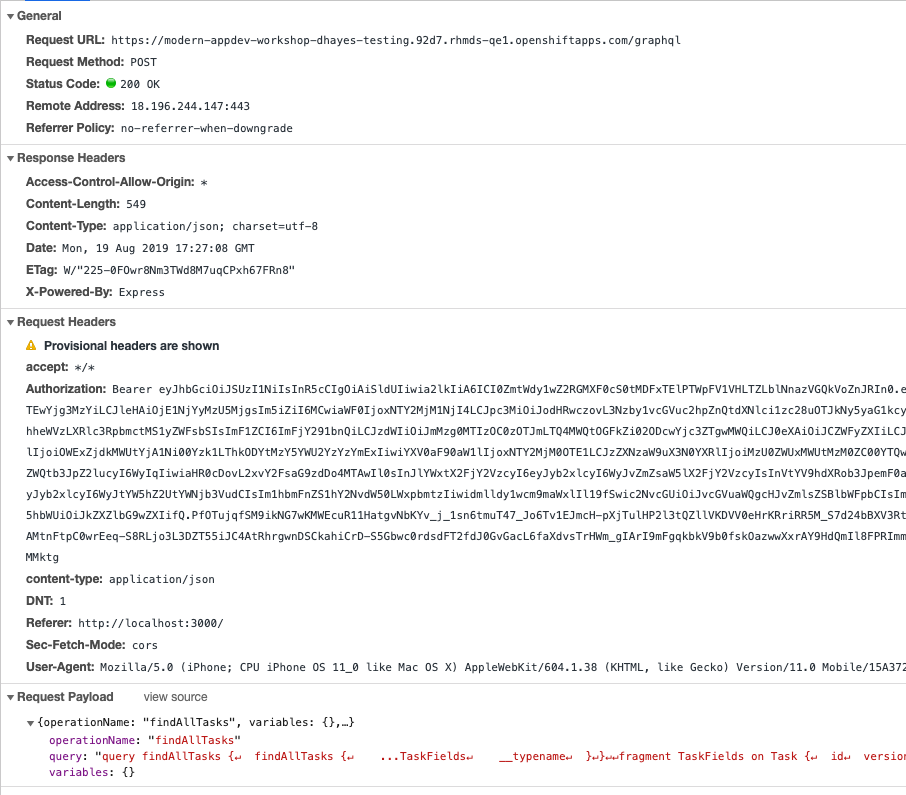

# Enterprise Mobile AppDev Workshop

Workshop for enterprise enabled modern application development using 
AeroGear and Mobile Developer service technologies

## General information

This tutorial is backed by [aerogear/modern-appdev-workshop](https://github.com/aerogear/modern-appdev-workshop) github repository.

This repository contains a template application for the [`graphback`](https://www.npmjs.com/package/graphback-cli) command line client.

`./template` contains a graphback server template used to initialize the project.
`./template/client` contains a react application (`create-react-app`) used to contact the server.

When using `graphback`, the template will be instantiated as your own project with:

- `/` will contain the server side code.
- `./client` will contain the client side code.

Please refer to the `completed` branch that contains finished version of this tutorial.

## Introduction

This workshop is focused on deploying a fully functional web application server using

- Node.js Server exposing GraphQL and REST API
- React.js Client PWA application

The workshop is divided into the following sections:

1. Bulding Your first GraphQL Server using AeroGear Graphback and AeroGear Voyager-Server
2. Bulding Your first GraphQL Client with React, GraphQL and AeroGear DataSync
3. Implementing Offline support and Conflict resolution in your applications
4. Deployment to OpenShift
5. Creating an Application in The Mobile Developer Console
6. Binding the Server to your App Using the Mobile Developer Console
7. Enabling Auth Service (Keycloak) in the Application.

## Prerequisites

- Node.js LTS 10 
- Docker and docker-compose
- Visual Studio Code (or other IDE)

## 1. Bulding your first GraphQL server using AeroGear Graphback

The Graphback cli (https://graphback.dev) allows developers 
to generate a fully functional Node.js based server offering
GraphQL and RESTful APIs out of the box based on developer provided business model.
Graphback generates the general data access methods like find, create, delete etc. along with 
live updates called subscriptions.

In this chapter we are going to build a sample application that will
be based on the custom server template we have provided. 
We going to implement Task model, however we can introduce any changes into the schema 
at later stage to show power of GraphQL and Graphback.

The example server contains the following technologies:

- AeroGear Voyager Server (including audit logging, metrics and keycloak integration)
- PostgreSQL database
- Apollo GraphQL server (Express.js based)

### Steps

1. Install graphback client
```
 npm install -g graphback-cli
```
2. Create new project based on template
```
graphback init node-workshop ---templateUrl=https://github.com/aerogear/modern-appdev-workshop
```
In cmd please answer questions as follows:
```
? Do you want to include a example model? No
? Choose your database PostgreSQL
```
3. Change directory into project folder
```
cd node-workshop
```
4. Review the `Task.graphql` file inside `model` with your GraphQL types.
This file was added as part of the template. GraphBack allows you to 
provide your own business logic, but for this example we will use logic that
was provided as part of the template. We can extend it at any point later.

5. Subscriptions are used in GraphQL to enable recieving real time updates from server. 
Graphback offers out of the box support for subscriptions providing updates for create, update and delete operations separately. For this workshop we going to consume only create 
Open `config.json` in the root of the directory and enable the `subCreate` flag.
```
 "subCreate": true,
```
This flag is used to tell graphback that we would like to generate the Subscriptions, particularly when a items are created.

6. Run `graphback generate` to generate schema and resolvers

7. Run `docker-compose up -d` to run your database and `graphback db` to create database resources in postgres database.

8. Run `npm run start` to start the server

9. The server will be ready at http://localhost:4000/graphql

10. The server offers the playground as a way to interact with its API.
It is loaded with example queries that can be used to access data - createTask, updateTask etc.
Please try to execute some operations directly using playground.

> Note: Please make any change in the playground editor first to see queries available when pressing big play button. 

The Playground also offers documentation for all available operations that we can replicate back to server. 
Documentation is automatically generated from the GraphQL Schema.

## 2. Building Your first GraphQL Client with React, GraphQL and AeroGear DataSync

The server side template has a `client` folder that contains a sample React project. 
It was bootstrapped using `create-react-app` and has some additional technologies: 

- React.js TypeScript template
- *AeroGear Voyager Client* that will offer *Data Synchronization* and 
*Conflict resolution*.
- *Uniforms* - Library for building GraphQL forms based on GraphQL schema.

### Steps

1. Navigate to `./client`
2. Install required dependencies for the project
```
npm install 
```
3. Run project
```
npm run start 
```
At this point we should see the web application connecting with the server and 
using the autogenerated api.

## 3. [Optional] Implementing Offline support and Conflict resolution in your applications

In this step, we can use the power of Graphback custom method generator together with the Conflict detection and resolution 
capabilities of the Voyager framework. Let's create a custom GraphQL implementation for the server that will ensure data consistency
and then connect it with the client application.

Voyager-server allows out of the box conflict resolution based on implementations - like `version` field marker in model, but for this use case 
we decided to show you how this works under the hood.

1. Navigate to `./model/Task.graphql` and paste the following code: 

```graphql
type Mutation {
  assign(id: ID!, status: String!, version: Int!):Task
}
```

2. Regenerate backend using `graphback generate` 
This will create an empty function we can implement in the next step.

3. Go to `src/resolvers/custom/assign.ts`. This file will contain custom an
implementation that we can use to implement task assignment.

4. Copy code from `./tutorial/assign.ts-template` to `assign.ts` file

5. Restart server

6. At this point, we can make requests to the server that will be checked for integrity. 
When we pass an outdated version server will return an error.

7. We can now connect our app with the server.
Go to `client/src/components/AssignTask.tsx`, delete line 6, 7, 8 and uncomment
the code responsible for sending mutation back to the server

8. Now open the application and you should see version changing when 
toggle is pressed.

## 4. Deployment to OpenShift

### Prerequisites

* Create an account on [Dockerhub](https://hub.docker.com/)

An OpenShift template is provided to deploy the backend server on OpenShift.

NOTE: If you'd like to skip the docker build steps, you can go straight to step 4 and use the image `aerogear/app-dev-workshop:latest`

### Steps

1. Log in to the Dockerhub Registry
```bash
docker login
```
2. Build the application into a docker image.
```bash
docker build -t <dockerhubusername>/<imagename>:latest . # ex: docker build -t aerogear/app-dev-workshop:latest .
```
3. Push the image to Dockerhub
```bash
docker push <dockerhubusername>/<imagename>:latest
```

4. Ask for OpenShift server url that can be used for deployment. 

5. Login using your oc command line client

```bash 
oc login
```

6. Create new namespace that will be used to deploy this project. Use your own name to avoid clashes.

```bash 
oc create -n '{your-name}-server'
```

5. Create the OpenShift template in a namespace of your choice
```bash
oc process -f openshift-template.yml --param APPLICATION_IMAGE=<dockerhubusername>/<imagename>:latest | oc create -f -
```

## 5. Creating an Application in The Mobile Developer Console

The Mobile Developer Console (MDC) bootstraps mobile application development on OpenShift by making it simple to provision and bind Mobile Services to your Application. Let's create a representation of our Application in the MDC.

1. Go to the MDC URL.
2. Create a new Application in The MDC if you haven't already.



Once the application is created, you can click on it to bring you to a new overview page. On the left side, there is some information about how you can get started on using the `aerogear-js-sdk`. On the right side, the `mobile-services.json` is visible. The `mobile-services.json` is a config file generated by the MDC that we drop into our application, enabling integrations with various mobile services such as Identity Management (Keycloak), Metrics, Push, Metrics and Sync.



## 6. Binding the Server to Your App Using the Mobile Developer Console

Let's use the MDC to bind to the server deployed in the previous step. This will provide our application with the configuration needed to talk to the server provisioned in OpenShift instead of one running locally.

1. Select your Mobile App from the MDC.
2. Click the `Mobile Services` tab. This shows you a list of available services that can be bound to your app.
3. Click the `Bind to App` button on the `Data Sync` service from the list.
4. In the form, provide the public URL for your backend server. (You can find this with `oc get route` from within the project where you deployed the server.)



5. Once, the sync service is bound, navigate back to the `Configuration` tab in the MDC.
6. You should see that the `mobile-services.json` has been updated.



7. Copy the `mobile-services.json` into `client/src/mobile-services.json` in your local project.
8. Restart your client application locally with `npm run start`.

You should notice this time when the application restarts that any Task items previously created are gone. This is because our app is now working against the server running in OpenShift. You can double check this by opening the network tab in Chrome Dev Tools (or the dev tools equivalent in other browsers), refreshing the page and inspecting the `graphql` requests being sent.



## 7. Enabling Auth Service (Keycloak) in the Application.

Let's add a keycloak integration to our react application. We can do this by binding the Identity Management Service from the MDC. When we create a binding for the Identity Management Service, a new Keycloak realm is created specifically for our application and a starter public client is created with some default values that allow logins from web applications.

1. Go to the `Mobile Services` tab in the MDC.
2. Click the `Bind to App` button on the Identity Management Service.
3. For the form, leave any default values as they are and for the admin username and password, use any values you wish but be sure to remember them. These values will be used to log in to Keycloak to administer our application's realm.



4. Once the service is bound, go back to the `Configuration` tab in the MDC and verify that the `mobile-services.json` has been updated.



7. Copy the `mobile-services.json` into `client/src/mobile-services.json` in your local project.
8. Restart your client application locally with `npm run start`

This time when the application starts, you should be presented with a keycloak login screen. At this point, we need a username/password combination to log in. Let's quickly create one in the Keycloak Console.

1. Go to the `Configuration` tab in the MDC.
2. Under the Bound Services section, expand the panel for the Identity Management Service. In there you will find the `Keycloak Realm Url`.
3. Open the URL and log in using the credentials created during the bind step.
4. In the Keycloak Console, select `Users` from the side menu.
5. Click 'Add User'
6. Fill out the username as `developer` and toggle the `Email Verified` option to true.
7. Once the user is created, find the `Credentials` tab and set the user's password and toggle `Temporary` to `Off`.
8. Go back to the react application and log in using the new user.

At this point, you should see the main screen of the application again. You can also check in Chrome Dev Tools (or the dev tools equivalent in other browsers) that the `Authorization` header is included in the GraphQL requests being sent to the server. This can be used by the server to authenticate the requests when the keycloak integration is set up on the server side.



### How it works

The Application discovered the Keycloak specific config at startup and used it to enable the keycloak integration. This was done using a combination of the `@aerogear/auth` and `react-keycloak` modules.

In `index.tsx` you can see how the root component being passed into `ReactDOM.render` is being wrapped with a function called `withAuth`. You can see how it works by looking at the code in `client/src/services/auth.service.tsx`.

